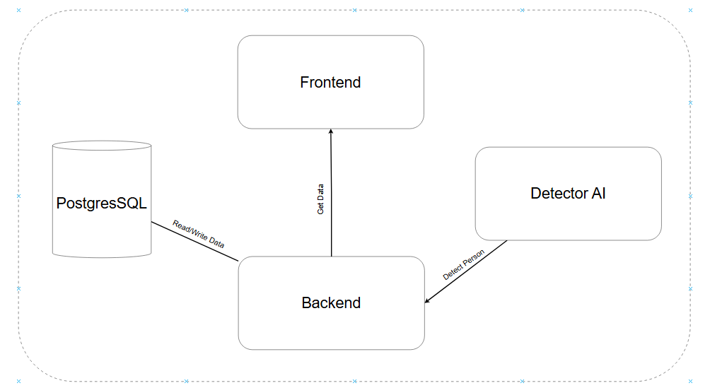

# Person Detection System

A comprehensive **web application** for detecting and counting people in images using advanced computer vision techniques. The system provides real-time detection with a user-friendly interface and maintains a detailed history of all detection results.


## Table of content
- [Person Detection System](#person-detection-system)
- [Table of content](#table-of-content)
- [Features](#features)
- [Architecture](#architecture)
- [Project Structure](#project-structure)
- [Setup Instructions](#setup-instructions)
    - [Prerequisites](#prerequisites)
    - [Environment Configuration](#environment-configuration)
    - [Running the Application](#running-the-application)
        - [Using Task](#using-task)
        - [Using Docker Compose directly](#using-docker-compose-directly)
    - [Building the Application](#building-the-application)
        - [Using Task](#using-task-1)
        - [Using Docker Compose directly](#using-docker-compose-directly-1)
    - [Usage](#usage)
- [API Endpoints](#api-endpoints)
- [Technology Stack](#technology-stack)
- [Cleaning Up](#cleaning-up)

## Features
- Image Upload: Easily upload images for people detection

- Real-time Detection: Detects and counts people using advanced computer vision (YOLOv12)

- Results Visualization: View detection results with bounding boxes around detected people

- Detection History: Browse and filter previous detection results

- Detailed Statistics: View information about each detection including timestamps and people count

- Responsive UI: Works on desktop and mobile devices

## Architecture



The system consists of three main components:

- Frontend: Next.js application with Tailwind CSS for UI
- Backend: FastAPI service for business logic and database operations
- Detector: Specialized service for running ML-based people detection algorithms

All components are containerized using Docker for consistent deployment environments.

## Project Structure

```text
.
├── backend/              # FastAPI backend service
│   ├── app/              # Python application code
│   ├── Dockerfile        # Docker configuration
│   └── requirements.txt  # Python dependencies
├── detector/             # ML detection service
│   ├── app/              # Detection algorithms
│   ├── Dockerfile        # Docker configuration
│   └── requirements.txt  # Python dependencies
├── frontend/             # Next.js frontend application
│   ├── app/              # Next.js application directory
│   ├── public/           # Static assets
│   ├── src/              # Source code
│   └── Dockerfile        # Docker configuration
├── uploads/              # Storage for uploaded images
├── results/              # Storage for detection results
├── docker-compose.dev.yml   # Docker configuration for development
└── docker-compose.prod.yml  # Docker configuration for production
```

## Setup Instructions

### Prerequisites

- Docker and Docker Compose
- Task (optional, for running task commands)

### Environment Configuration

**1.** Copy the environment template to create your environment file:

```bash
cp .env_template .env
```

**2.** Modify the `.env` file if needed to adjust ports or configuration values:

### Running the Application

**Using Task**

#### For development:

```bash
task run_dev
```
#### For production:

```bash
task run_prod
```

### Using Docker Compose directly

#### For development:

```bash
docker-compose -f docker-compose.dev.yml up
```
#### For production:

```bash
docker-compose -f docker-compose.prod.yml up
```

### Building the Application

**Using Task**

#### For development:

```bash
task build_dev
```
#### For production:

```bash
task build_prod
```

### Using Docker Compose directly

#### For development:

```bash
docker-compose -f docker-compose.dev.yml up --build
```
#### For production:

```bash
docker-compose -f docker-compose.prod.yml up --build
```

### Usage

1. Access the web interface at http://localhost:3000 (default port)
2. Upload an image using the upload interface
3. View detection results showing people count and bounding boxes
4. Browse detection history on the History page
5. Filter history by date, people count, or filename
6. Click on individual records to see detailed results

### API Endpoints

1. **Detection**
- `POST /api/v1/detect` - Upload an image and detect people
2. **History**
- `GET /api/history` - Get detection history records
- `GET /api/history/:id` - Get details of a specific detection record

### Technology Stack

- **Frontend**: Next.js, React, Tailwind CSS
- **Backend**: FastAPI, SQLAlchemy
- **Database**: PostgreSQL
- **ML/Computer Vision**: YOLOv12
- **Infrastructure**: Docker, Docker Compose

### Cleaning Up
To clean up containers and system resources:

```bash
task clean
```

or

```bash
docker-compose -f docker-compose.dev.yml down
docker-compose -f docker-compose.prod.yml down
docker system prune -f
```